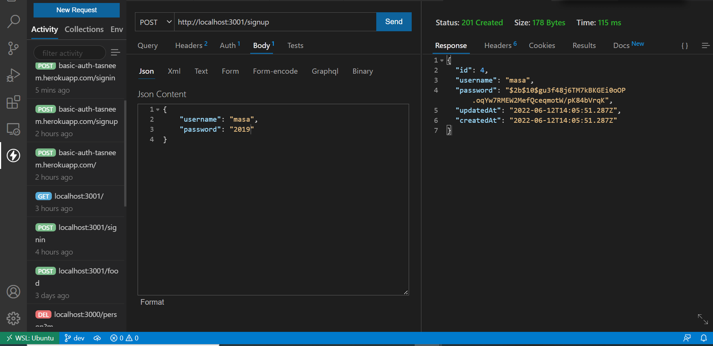
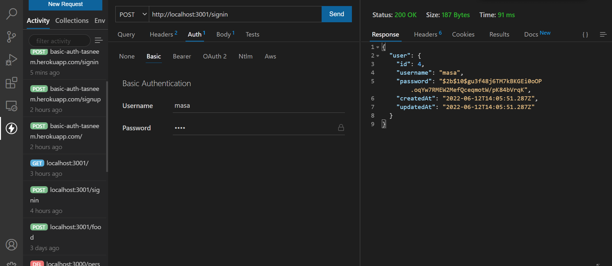

# basic-auth:

Authentication System: Deploy an Express server that implements Basic Authentication, with signup and signin capabilities, using a Postgres database for storage.

[heroku link](https://basic-auth-tasneem.herokuapp.com/users)
[heroku link](https://basic-auth-tasneem.herokuapp.com/signin)
[heroku link](https://basic-auth-tasneem.herokuapp.com/signup)

 
 
 
 
 

